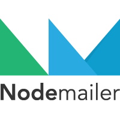

## Hi there 👋

Hello! I'm Carlos Figueira, a passionate backend developer from Venezuela. I thrive on building robust and scalable applications, and I'm always eager to expand my knowledge and explore new technologies.

**About Me:**

I specialize in crafting efficient and reliable backend solutions, with a strong focus on Node.js and its ecosystem. My expertise spans a wide range of technologies, including:

**Tech Stack:**

 Node.js
 NestJS
 TypeScript
 PostgreSQL
 MongoDB
 TypeORM
 Mongoose
 JWT
 Swagger
 WebSocket.io
 Stripe
 NodeMailer
 Javascript
 Express

I have hands-on experience developing backend systems for e-commerce projects, handling everything from user authentication and data management to payment integrations and real-time updates. I'm committed to writing clean, maintainable code and delivering high-quality solutions.

I'm continuously learning and seeking opportunities to collaborate on challenging projects. If you're looking for a dedicated backend developer with a passion for building innovative solutions, let's connect!

**Connect with me:**

* [LinkedIn](YOUR_LINKEDIN_PROFILE_URL)
